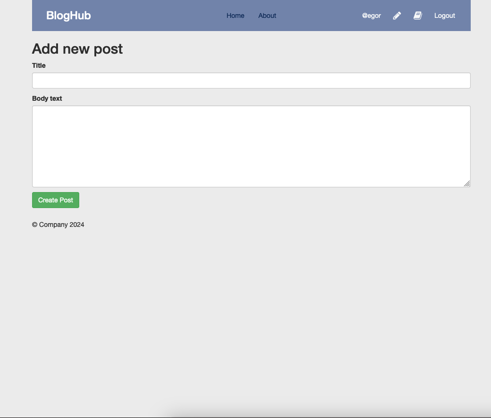

# README

## Description

This is a simple blog application build with Ruby on Rails and PostgreSQL.

## Screenshots





## Installation

1. Clone the repository

```bash
git clone https://github.com/JanaLigotkina/blog.git
```

2. Install dependencies

```bash
bundle install
```

3. Docker

```bash
docker-compose up
```

4.Create and migrate the database

```bash
rails db:create
rails db:migrate
```

4. Run the server

```bash
rails s
```


